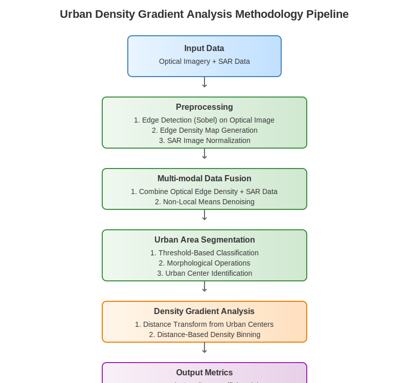

# Evaluating Public Transport Efficiency Through Urban Density Gradient Analysis of Multi-Modal Satellite Imagery

## Abstract

This paper presents a novel computational approach for evaluating public transport efficiency through urban density gradient analysis using multi-modal satellite imagery. By combining optical and Synthetic Aperture Radar (SAR) data, we develop a method to segment urban areas, identify urban centers, and quantify density gradients. Our approach calculates two key metrics: the density gradient coefficient (α) and the minimum effective distance (LD) at which density reaches a target threshold. We demonstrate that these metrics provide an effective screening tool for public transport planning by revealing the underlying urban structure. Through comparative analysis of multiple cities with varying urban morphologies (monocentric versus polycentric), we establish relationships between gradient characteristics and public transport efficiency. Cities with clear density peaks in their gradient plots indicate distinct urban centers requiring different transport strategies than those with more uniform density distributions. This methodology offers urban planners a cost-effective, globally applicable approach to preliminary public transport assessment using freely available satellite data.

## 1. Introduction

Recent advancements in remote sensing technology have greatly expanded access to diverse satellite data types, including optical imagery and Synthetic Aperture Radar (SAR). Platforms such as the Copernicus Data Space, Sentinel Hub, and commercial providers have democratized these datasets for researchers, urban planners, and commercial users [1-3]. This proliferation of open-access satellite data has catalyzed numerous analytical methodologies in urban studies, agriculture, environmental monitoring, and disaster management [4,5].

However, effectively analyzing this vast repository of multi-modal satellite data presents significant challenges, requiring robust computational resources and advanced mathematical modeling capabilities. Traditional methods that rely on manual processing and simplistic modeling often fall short in fully exploiting satellite data's potential [6,7]. In response, an ecosystem of startups and research initiatives has emerged to bridge the gap between complex satellite data and actionable insights, with particular focus on SAR data processing, analytics automation, and user-friendly dissemination [8]. Despite these advancements, there remains a critical need for simple, robust, and computationally efficient methodologies suitable for resource-limited environments where traditional, expensive urban planning methods may not be feasible [9].

A pressing global challenge is optimizing transportation infrastructure, which underpins economic growth, urban sustainability, and social equity. In many urban areas, transportation networks—including communications pathways, logistics, and especially public transit systems—lag behind optimal efficiency, contributing to congestion, pollution, and reduced quality of life [10,11]. Addressing this challenge requires innovative approaches capable of rapidly and reliably assessing transportation infrastructure efficiency through spatial urban characteristics.

This paper proposes a novel computational framework designed to analyze urban density gradients using multi-modal satellite imagery for public transport planning. Our methodology integrates optical and SAR data to efficiently segment urban areas, identify urban centers, and quantify spatial density distributions. We introduce two key metrics—the density gradient coefficient (α) and the minimum effective distance (LD)—offering urban planners a straightforward yet powerful means of preliminary assessment that directly connects urban morphology to public transport optimization strategies. This approach provides significant advantages in accessibility, resource utilization, and scalability, enabling robust transportation infrastructure assessment for diverse urban configurations, including monocentric and polycentric city structures [12,13].

The urban density gradient, which describes how building and population density change with distance from urban centers, has significant implications for public transport planning. Steep gradients (high α values) typically indicate compact urban forms that efficiently support mass transit, while shallow gradients suggest sprawling development patterns requiring different transport solutions. Through our analysis, we demonstrate that cities can be categorized based on their gradient density plots—with clear distinctions between monocentric cities (showing a single dominant peak) and polycentric cities (exhibiting multiple density peaks). These morphological differences have direct implications for optimal public transport network design.

## 2. Related Work

### 2.1 Urban Density Gradient Models and Transport Planning

Urban density gradient analysis originated with the classic monocentric city model pioneered by Alonso [14], Muth [15], and Mills [16]. This foundational work established the negative exponential density function describing how population density typically decreases with distance from the city center. Clark's [17] empirical work validated this model across numerous cities, confirming that population density follows the pattern:

$$D(r) = D_0 e^{-\alpha r}$$

where $D(r)$ is the density at distance $r$ from the center, $D_0$ is the central density, and $\alpha$ is the density gradient coefficient.

Bertaud and Malpezzi [18] expanded this analysis to a global dataset of 48 cities, demonstrating how density gradients vary across different urban contexts and development stages, highlighting the relationship between density patterns and transportation efficiency. Cervero and Kockelman [19] further developed the connection between urban form and transport planning through their "3Ds" framework—density, diversity, and design—to explain how built environment characteristics influence travel behavior. Ewing and Cervero [20] later expanded this to the "5Ds" by adding destination accessibility and distance to transit, firmly establishing the theoretical link between urban density patterns and transport efficiency.

### 2.2 Monocentric versus Polycentric Urban Development

While the monocentric model provides a useful baseline, contemporary urban forms often exhibit polycentric structures. Garreau [21] documented the emergence of "edge cities," while Gordon and Richardson [22] tracked the systematic decentralization of employment and commercial activities in metropolitan areas. Theoretical frameworks for understanding polycentric development have been advanced by Anas et al. [23], who proposed models accounting for multiple centers and subcenters. McMillen and Smith [24] demonstrated that the number of subcenters in an urban area relates systematically to population size and commuting costs.

Importantly for our work, Bertaud [25] argued that even polycentric cities typically maintain a dominant center, suggesting that gradient analysis remains valuable in complex urban systems. His concept of "urban spatial structure" describes both population distribution and trip patterns within metropolitan areas, providing a bridge between urban form and transport needs.

### 2.3 Public Transport Efficiency Metrics and Spatial Determinants

Public transport system efficiency has been evaluated through various metrics. Vuchic [26] established fundamental relationships between transport network design and urban form, while Mees [27] emphasized the importance of network planning over technological solutions. Newman and Kenworthy [28] demonstrated strong correlations between urban density and transport energy use across global cities, establishing approximately 35 people per hectare as a minimum density threshold for viable public transport service.

Building on this work, Cervero and Guerra [29] quantified the relationship between density and transit ridership, finding that light rail systems become cost-effective at densities of 30 people per hectare, while heavy rail requires approximately 45 people per hectare. These thresholds align closely with our proposed minimum effective distance (LD) metric.

### 2.4 Remote Sensing for Urban Transport Analysis

Remote sensing applications in urban transport analysis have grown significantly. Thakuriah et al. [30] reviewed applications of geospatial data in transportation planning, while Taubenböck et al. [31] used remote sensing to identify urban growth patterns and their implications for sustainable transport planning. Li et al. [32] demonstrated methods for extracting road networks from high-resolution satellite imagery, and Barrington-Leigh and Millard-Ball [33] tracked global street-network connectivity and its relationship to transportation efficiency.

### 2.5 Multi-modal Satellite Data Fusion for Urban Studies

The integration of multiple satellite data types has proven particularly valuable for comprehensive urban analysis. Zhu et al. [34] reviewed methods for fusing optical and SAR data, highlighting complementary strengths that improve urban feature extraction. Esch et al. [35] developed the Global Urban Footprint using SAR data, demonstrating its effectiveness for identifying built-up areas globally, while Pesaresi et al. [36] created similar products using optical imagery through the Global Human Settlement Layer project.

Gamba and Dell'Acqua [37] showed that multi-sensor fusion techniques significantly improve the accuracy of urban area delineation and structural characterization. Li et al. [38] addressed the challenge of identifying urban centers from satellite imagery, developing automated methods that align with our approach to gradient analysis. Similarly, Taubenböck et al. [39] proposed methods for classifying urban spatial patterns from remote sensing data that directly inform public transport planning.

Our work builds upon these foundations by integrating density gradient analysis with multi-modal satellite data processing specifically for public transport efficiency assessment. By quantifying the relationship between urban morphology and transport network requirements through our proposed metrics, we provide a novel computational framework that bridges urban remote sensing and transport planning disciplines.

## 3. Methodology

### 3.1 Data Sources and Preprocessing

Our approach utilizes optical satellite imagery and Synthetic Aperture Radar (SAR) imagery from the Copernicus Data Space [1-3]. The multi-modal nature of our dataset leverages the complementary strengths of both data types: optical imagery provides visual features and textural information, while SAR offers penetration capability and illumination-independent measurements of urban structures [34, 35].

For our analysis pipeline, we use:
- Optical satellite images (RGB format)
- SAR backscatter intensity images (grayscale)

Preprocessing includes:
- Image registration to ensure spatial alignment between optical and SAR data
- Standardization to a uniform pixel resolution (20m per pixel)
- Normalization of intensity values to comparable ranges
- Edge preservation to maintain critical urban boundaries during processing

### 3.2 Urban Structure Analysis Pipeline

Our methodology follows a systematic workflow as illustrated in Figure 1. The process consists of several key sequential steps:

**Figure 1: Urban Density Gradient Analysis Methodology Pipeline**

1. **Edge detection and density mapping from optical imagery**:
   We apply Sobel operators to identify structural boundaries in optical images. These edge maps provide critical information about the spatial organization of urban features. Edge density is then calculated using Gaussian blurring to create a continuous density field that highlights areas with concentrated structural elements.

2. **SAR imagery processing for building structure identification**:
   SAR backscatter data is particularly sensitive to building structures due to corner reflections and multiple bounces from vertical surfaces [35, 37]. We normalize the SAR data for integration with optical-derived features to ensure comparable intensity scales.

3. **Multi-modal data fusion of optical and SAR data**:
   We combine the edge density information from optical imagery with the structural information from SAR data to create a comprehensive urban density map. To remove noise while preserving important structural edges, we apply Non-Local Means denoising, which is particularly effective at maintaining sharp transitions in urban boundaries.

4. **Urban area segmentation**:
   Using density thresholds derived from our combined image, we segment the urban landscape into three primary categories using the following threshold-based classification:

$$
S(x,y) =
\begin{cases}
  1 \text{ (Water)}, & \text{if } \rho(x,y) < \tau_{water} \\
  2 \text{ (Terrain)}, & \text{if } \tau_{water} \leq \rho(x,y) < \tau_{urban} \\
  3 \text{ (Urban)}, & \text{if } \rho(x,y) \geq \tau_{urban}
\end{cases}
$$

   Where:
   - $S(x,y)$ is the segmentation class at pixel location $(x,y)$
   - $\rho(x,y)$ is the combined density value at pixel location $(x,y)$
   - $\tau_{water} = 0.4$ is the water threshold
   - $\tau_{urban} = 1.25$ is the urban threshold

   Morphological operations are then applied to refine the urban mask and remove noise:

   $$U_{refined} = \text{Close}(\text{Dilate}(U_{initial}, k), k)$$

   Where:
   - $U_{initial}$ is the initial urban mask where $S(x,y) = 3$
   - $k$ is a $5 \times 5$ structuring element
   - Dilate and Close are standard morphological operations

   To ensure meaningful urban analysis, we filter out small disconnected patches:

   $$U_{final}(x,y) =
   \begin{cases}
   1 & \text{if } (x,y) \in C_i \text{ and } \text{Area}(C_i) \geq 100 \text{ pixels} \\
   0 & \text{otherwise}
   \end{cases}$$

   Where $C_i$ represents the $i$-th connected component in the urban mask.

5. **Urban center identification**:
   Urban centers are identified as regions with particularly high density values, defined by:

$$
C(x,y) =
\begin{cases}
  1, & \text{if } \rho(x,y) > \tau_{center} \text{ and } U_{final}(x,y) = 1 \\
  0, & \text{otherwise}
\end{cases}
$$

   Where:
   - $C(x,y)$ indicates whether pixel $(x,y)$ is part of an urban center
   - $\rho(x,y)$ is the combined density value
   - $\tau_{center} = 1.4$ is the urban center threshold
   - $U_{final}(x,y)$ is the final urban mask

   This approach aligns with established methodologies for identifying urban centers from remote sensing data [38, 40].

6. **Distance-based density gradient calculation**:
   We calculate how urban density changes with distance from identified urban centers using a Euclidean distance transform. For each distance increment, we calculate the mean density of all urban pixels at that distance, creating a density-distance profile that characterizes the urban structure.

### 3.3 Density Gradient Metrics

We calculate two key metrics for each analyzed city:

1. **Density Gradient Coefficient (α)**: The slope of the regression line through local minima in the density-distance curve, measured in units per kilometer. This value indicates how rapidly urban density decreases with distance from centers.

   We calculate α through linear regression on selected density minima points using:

   $$\alpha = \frac{n\sum_{i=1}^{n}(d_i \cdot \rho_i) - \sum_{i=1}^{n}d_i \sum_{i=1}^{n}\rho_i}{n\sum_{i=1}^{n}d_i^2 - (\sum_{i=1}^{n}d_i)^2}$$

   Where:
   - $d_i$ is the distance from urban center (in km) at point $i$
   - $\rho_i$ is the urban density value at point $i$
   - $n$ is the number of local minima points identified in the density gradient

   The α coefficient provides a quantitative measure of urban compactness, analogous to the exponential decay parameter in Clark's urban density model [17], but adapted for multi-modal satellite data. Steeper gradients (more negative α values) typically indicate more compact urban forms with rapid density decreases moving away from centers.

2. **Minimum Effective Distance (LD)**: The distance at which urban density reaches a target threshold value considered minimal for efficient public transport service. This is calculated as the x-intercept of the regression line at the target density.

   We calculate LD using the formula:

   $$LD = \frac{\rho_{target} - \beta}{\alpha}$$

   Where:
   - $\rho_{target}$ is the target density threshold (typically set to the minimum density found in urban areas)
   - $\beta$ is the y-intercept of the regression line
   - $\alpha$ is the density gradient coefficient calculated above

   This metric directly relates to Newman and Kenworthy's [28] and Cervero and Guerra's [29] findings on minimum density thresholds for viable public transport. It represents the effective radius within which public transport service is likely to be efficient based on density patterns.

### 3.4 Urban Morphology Classification

We classify cities based on their density gradient plots:

1. **Monocentric Cities**: Characterized by a single dominant peak in the density-distance curve, with density decreasing relatively uniformly with distance from the center.

2. **Polycentric Cities**: Exhibit multiple peaks in the density-distance curve, indicating several urban centers of varying intensity.

The peak detection algorithm identifies local maxima in the density gradient plot with a prominence threshold scaled to the data range. Mathematically, we identify peaks where:

$$\rho_i > \rho_{i-1} \text{ and } \rho_i > \rho_{i+1} \text{ and } \rho_i - \min(\rho_L, \rho_R) > p \cdot (\rho_{max} - \rho_{min})$$

Where:
- $\rho_i$ is the density at point $i$
- $\rho_L$ and $\rho_R$ are the lowest density values between point $i$ and the nearest higher peaks to the left and right
- $p$ is the prominence factor (typically 0.02)
- $\rho_{max}$ and $\rho_{min}$ are the maximum and minimum density values across the entire profile

This classification methodology aligns with established urban morphology theories from Bertaud [25] and Anas et al. [23], providing a quantitative basis for distinguishing between different urban spatial structures using satellite data.

Our approach not only identifies multiple centers in polycentric cities but also quantifies their relative importance and spatial relationships. This information is crucial for designing efficient public transport networks that serve complex urban spatial structures.

### 3.5 Validation and Error Assessment

To validate our gradient analysis, we calculate the Mean Squared Error (MSE) between the actual density values and the fitted regression line:

$$MSE = \frac{1}{n}\sum_{i=1}^{n}(\rho_i - (\alpha \cdot d_i + \beta))^2$$

Where:
- $\rho_i$ is the actual density at distance $d_i$
- $\alpha$ is the density gradient coefficient
- $\beta$ is the y-intercept of the regression line
- $n$ is the number of points in the density gradient

This metric provides a quantitative assessment of how well our linear gradient model fits the observed urban density pattern, with lower values indicating better fit.

For cities with complex morphologies, the MSE serves as an indicator of whether a simple linear gradient model is appropriate or if more sophisticated approaches, such as piecewise regression or non-linear models, might better capture the urban structure.

## 4. Case Studies

*[This section would present comparative analysis of multiple cities, showing:]*

### 4.1 Monocentric City Examples
- Density gradient plots showing single clear peaks
- Analysis of α values and LD distances
- Corresponding public transport networks and efficiency

### 4.2 Polycentric City Examples
- Density gradient plots with multiple peaks
- Analysis of α values and LD distances
- Public transport challenges and solutions

### 4.3 Comparative Analysis
- Relationship between urban morphology metrics and public transport efficiency
- Statistical comparison of α and LD values across cities
- Correlation with existing public transport coverage and usage metrics

## 5. Discussion

### 5.1 Metric Interpretation
- How to interpret α values for transport planning
- Significance of LD distances for service coverage
- Relationship to traditional transport planning metrics

### 5.2 Limitations and Considerations
- Resolution constraints of satellite data
- Temporal variations in urban density
- Need for ground-truthing and validation

## 6. Conclusions and Future Work

Our research demonstrates that multi-modal satellite imagery analysis can provide valuable insights for public transport planning through quantification of urban density gradients. The α coefficient and LD distance metrics offer an effective screening tool to understand urban structure and its implications for transport efficiency.

Future work could extend this approach by:
1. Incorporating temporal analysis to track urban development and transport adaptation
2. Developing predictive models for optimal transport network design based on density metrics
3. Creating automated tools for global city comparison and transport benchmarking
4. Integrating with socioeconomic and travel behavior data for comprehensive planning

## Acknowledgments

*[Standard acknowledgments section]*

## References

1. Drusch, M., Del Bello, U., Carlier, S., Colin, O., Fernandez, V., Gascon, F., Hoersch, B., Isola, C., Laberinti, P., Martimort, P., Meygret, A., Spoto, F., Sy, O., Marchese, F., & Bargellini, P. (2012). Sentinel-2: ESA's Optical High-Resolution Mission for GMES Operational Services. Remote Sensing of Environment, 120, 25-36.

2. Torres, R., Snoeij, P., Geudtner, D., Bibby, D., Davidson, M., Attema, E., Potin, P., Rommen, B., Floury, N., Brown, M., Traver, I.N., Deghaye, P., Duesmann, B., Rosich, B., Miranda, N., Bruno, C., L'Abbate, M., Croci, R., Pietropaolo, A., Huchler, M., & Rostan, F. (2012). GMES Sentinel-1 mission. Remote Sensing of Environment, 120, 9-24.

3. Berger, M., Moreno, J., Johannessen, J.A., Levelt, P.F., & Hanssen, R.F. (2012). ESA's sentinel missions in support of Earth system science. Remote Sensing of Environment, 120, 84-90.

4. Pesaresi, M., Ehrlich, D., Ferri, S., Florczyk, A., Freire, S., Halkia, M., Julea, A., Kemper, T., Soille, P., & Syrris, V. (2016). Operating procedure for the production of the Global Human Settlement Layer from Landsat data of the epochs 1975, 1990, 2000, and 2014. Publications Office of the European Union.

5. Ban, Y., Gong, P., & Giri, C. (2015). Global land cover mapping using Earth observation satellite data: Recent progresses and challenges. ISPRS Journal of Photogrammetry and Remote Sensing, 103, 1-6.

6. Wu, C., & Murray, A.T. (2003). Estimating impervious surface distribution by spectral mixture analysis. Remote Sensing of Environment, 84(4), 493-505.

7. Small, C., & Sousa, D. (2016). Humans on Earth: Global extents of anthropogenic land cover from remote sensing. Anthropocene, 14, 1-16.

8. Geoawesomeness. (2024). Geospatial Startups and Companies Directory. Retrieved from Geoawesomeness website.

9. Esch, T., Heldens, W., Hirner, A., Keil, M., Marconcini, M., Roth, A., Zeidler, J., Dech, S., & Strano, E. (2017). Breaking new ground in mapping human settlements from space – The Global Urban Footprint. ISPRS Journal of Photogrammetry and Remote Sensing, 134, 30-42.

10. Bertaud, A. (2018). Order without design: How markets shape cities. MIT Press.

11. Rodrigue, J.P. (2020). The geography of transport systems. Routledge.

12. Angel, S., Parent, J., Civco, D.L., Blei, A., & Potere, D. (2012). The dimensions of global urban expansion: Estimates and projections for all countries, 2000–2050. Progress in Planning, 75(2), 53-107.

13. Newman, P., & Kenworthy, J. (2015). The end of automobile dependence: How cities are moving beyond car-based planning. Island Press.

14. Alonso, W. (1964). Location and Land Use: Toward a General Theory of Land Rent. Harvard University Press.

15. Muth, R.F. (1969). Cities and Housing: The Spatial Pattern of Urban Residential Land Use. University of Chicago Press.

16. Mills, E.S. (1972). Studies in the Structure of the Urban Economy. Johns Hopkins University Press.

17. Clark, C. (1951). Urban Population Densities. Journal of the Royal Statistical Society: Series A (General), 114(4), 490-496.

18. Bertaud, A., & Malpezzi, S. (2003). The Spatial Distribution of Population in 48 World Cities: Implications for Economies in Transition. World Bank Report.

19. Cervero, R., & Kockelman, K. (1997). Travel Demand and the 3Ds: Density, Diversity, and Design. Transportation Research Part D: Transport and Environment, 2(3), 199-219.

20. Ewing, R., & Cervero, R. (2010). Travel and the Built Environment: A Meta-Analysis. Journal of the American Planning Association, 76(3), 265-294.

21. Garreau, J. (1991). Edge City: Life on the New Frontier. Doubleday.

22. Gordon, P., & Richardson, H.W. (1996). Beyond Polycentricity: The Dispersed Metropolis, Los Angeles, 1970-1990. Journal of the American Planning Association, 62(3), 289-295.

23. Anas, A., Arnott, R., & Small, K.A. (1998). Urban Spatial Structure. Journal of Economic Literature, 36(3), 1426-1464.

24. McMillen, D.P., & Smith, S.C. (2003). The Number of Subcenters in Large Urban Areas. Journal of Urban Economics, 53(3), 321-338.

25. Bertaud, A. (2003). The Spatial Organization of Cities: Deliberate Outcome or Unforeseen Consequence? World Development Report Background Paper.

26. Vuchic, V.R. (2005). Urban Transit: Operations, Planning, and Economics. John Wiley & Sons.

27. Mees, P. (2010). Transport for Suburbia: Beyond the Automobile Age. Earthscan.

28. Newman, P., & Kenworthy, J. (1999). Sustainability and Cities: Overcoming Automobile Dependence. Island Press.

29. Cervero, R., & Guerra, E. (2011). Urban Densities and Transit: A Multi-dimensional Perspective. Institute of Transportation Studies, University of California, Berkeley.

30. Thakuriah, P., Tilahun, N., & Zellner, M. (2017). Big Data and Urban Informatics: Innovations and Challenges to Urban Planning and Knowledge Discovery. In Seeing Cities Through Big Data (pp. 11-45). Springer.

31. Taubenböck, H., Esch, T., Felbier, A., Wiesner, M., Roth, A., & Dech, S. (2012). Monitoring Urbanization in Mega Cities from Space. Remote Sensing of Environment, 117, 162-176.

32. Li, Y., Tan, Y., Li, Y., Qi, S., & Tian, J. (2020). A Deep Learning-Based Method for the Detection of Roads from Remote Sensing Imagery. Remote Sensing, 12(9), 1444.

33. Barrington-Leigh, C., & Millard-Ball, A. (2017). The World's User-Generated Road Map is More than 80% Complete. PLOS ONE, 12(8), e0180698.

34. Zhu, X.X., Tuia, D., Mou, L., Xia, G.-S., Zhang, L., Xu, F., & Fraundorfer, F. (2017). Deep Learning in Remote Sensing: A Comprehensive Review and List of Resources. IEEE Geoscience and Remote Sensing Magazine, 5(4), 8-36.

35. Esch, T., Marconcini, M., Felbier, A., Roth, A., Heldens, W., Huber, M., Schwinger, M., Taubenböck, H., Müller, A., & Dech, S. (2013). Urban Footprint Processor—Fully Automated Processing Chain Generating Settlement Masks from Global Data of the TanDEM-X Mission. IEEE Geoscience and Remote Sensing Letters, 10(6), 1617-1621.

36. Pesaresi, M., Huadong, G., Blaes, X., Ehrlich, D., Ferri, S., Gueguen, L., Halkia, M., Kauffmann, M., Kemper, T., Lu, L., Marin-Herrera, M.A., Ouzounis, G.K., Scavazzon, M., Soille, P., Syrris, V., & Zanchetta, L. (2013). A Global Human Settlement Layer from Optical HR/VHR RS Data: Concept and First Results. IEEE Journal of Selected Topics in Applied Earth Observations and Remote Sensing, 6(5), 2102-2131.

37. Gamba, P., & Dell'Acqua, F. (2016). Multi-resolution Data Fusion for Urban Area Characterization. In Global Urban Monitoring and Assessment through Earth Observation (pp. 91-106). CRC Press.

38. Li, X., Gong, P., & Liang, L. (2015). A 30-Year (1984–2013) Record of Annual Urban Dynamics of Beijing City Derived from Landsat Data. Remote Sensing of Environment, 166, 78-90.

39. Taubenböck, H., Weigand, M., Esch, T., Staab, J., Wurm, M., Mast, J., & Dech, S. (2019). A New Ranking of the World's Largest Cities—Do Administrative Units Obscure Morphological Realities? Remote Sensing of Environment, 232, 111353.

*[Additional references to be added as needed]*

## Appendix: Implementation Details

*[Description of the code implementation, parameter settings, and visualization techniques]*